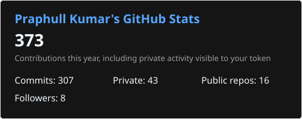
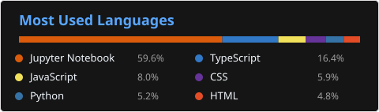

<h1 align="center">Hey, I'm Praphull Kumar :)</h1>

  

  B.Tech CSE (AI &amp; ML), 3rd Year 
  Passionate about Machine Learning, AI, and emerging technologies

  
  
  

---

## Tech Stack

**Languages**

**Frontend**

**Backend & Cloud**

**Data**

**Tools**

## GitHub Stats

<!-- SVGs are auto-updated every 6h by .github/workflows/update-stats.yml -->
## Connect

